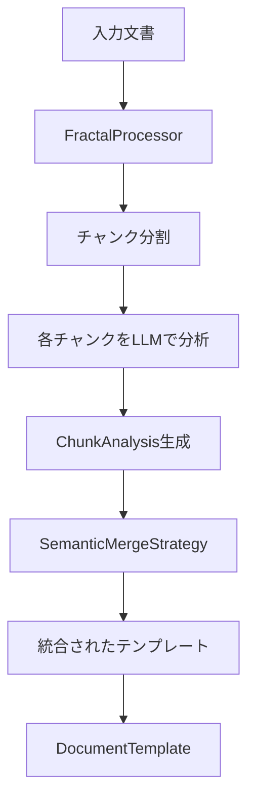
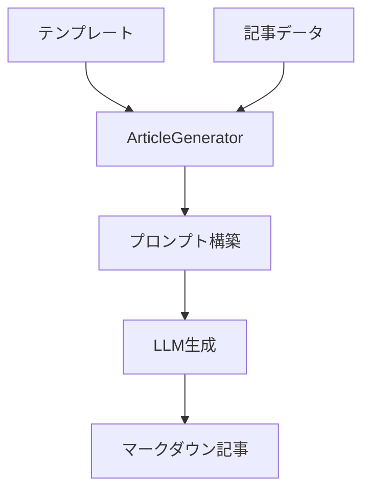

# Templex: AI記事生成ライブラリの処理フロー

## 📚 概要

Templexは、既存の文書から構造パターン（テンプレート）を抽出し、そのパターンを使って新しい記事を生成するAIライブラリです。

## 🔄 主要な処理フロー

### 1. テンプレート抽出プロセス



#### 1.1 チャンク分割とフラクタル処理

```typescript
// core.ts - FractalProcessorによる並列処理
const chunkAnalyses = await this.analyzeChunks(text, options, fractalProcessor);
```

- **FractalProcessor**（`@aid-on/fractop`）が大きな文書を効率的に処理
- テキストを約2000文字のチャンクに分割
- 各チャンクを並列でLLMに送信して分析
- フラクタル的に結果を統合（小→大へ階層的に統合）

#### 1.2 チャンク分析

各チャンクから以下の要素を抽出：

```typescript
interface ChunkAnalysis {
  elements: TemplateElement[];    // 構造要素（見出し、段落、リストなど）
  keywords: NormalizedKeyword[];  // 重要キーワードと重み
  patterns: Record<string, string>; // 文書パターン（opening、structure等）
  confidence: number;              // 信頼度スコア
  abstractTemplate?: AbstractTemplate; // 抽象テンプレート（オプション）
}
```

#### 1.3 セマンティック境界検出によるマージ

```typescript
// structure-merger.ts - 意味的な境界を検出して適切にマージ
export class SemanticMergeStrategy implements MergeStrategy {
  findBoundaries(elements: TemplateElement[]): number[] {
    // 複数のヒューリスティックを組み合わせて境界を検出
    // - 見出しレベルの変化
    // - コンテンツタイプの変化
    // - パターンの繰り返し
  }
}
```

### 2. 記事生成プロセス



#### 2.1 パターンベース生成

プリセットパターンを使った生成：

```typescript
// patterns.ts - 定義済みパターン
export const PRESET_PATTERNS = {
  'fear-driven': {     // 恐怖訴求型
    formula: '[恐怖フック] + [身近な例証] + [簡単な解説] + ...',
    components: [...]
  },
  'problem-solution': { // 問題解決型
    formula: '[問題提起] + [深刻性強調] + [解決策提示] + ...',
    components: [...]
  }
}
```

#### 2.2 多言語対応

```typescript
// generator.ts - 言語別プロンプト生成
private buildPromptJa(template: AbstractTemplate, data: ArticleData): string {
  return `説得力のある記事を以下のテンプレート構造とデータを使用して生成してください...`
}

private buildPromptEn(template: AbstractTemplate, data: ArticleData): string {
  return `Generate a persuasive article in English using the following template...`
}
```

## 🛠️ 技術的な工夫

### 1. 堅牢なJSON解析

LLMのレスポンスは不完全なJSONを返すことがあるため、複数の戦略で解析：

```typescript
// json-utils.ts
export function extractJSON<T = any>(text: string): T | null {
  // 1. そのまま解析を試みる
  // 2. マークダウンコードブロックから抽出
  // 3. バランスの取れたJSON構造を探索
  // 4. 一般的な問題（末尾カンマ、コメント等）を修正
}
```

### 2. 型安全性の確保

実行時型チェックで安全性を保証：

```typescript
// type-guards.ts
export function isTemplateElement(value: unknown): value is TemplateElement {
  // 実行時に型を検証
  if (!value || typeof value !== 'object') return false;
  const obj = Object(value);
  if (typeof obj.type !== 'string') return false;
  // ... 詳細な検証
}
```

### 3. キーワードの正規化と統合

異なる形式のキーワードを統一：

```typescript
// keyword-utils.ts
export function normalizeKeywords(keywords: unknown[]): NormalizedKeyword[] {
  // 文字列、オブジェクト、配列など様々な形式を正規化
  // 重複の除去と重みの統合
  // コンテキスト情報の保持
}
```

## 📊 処理の最適化

### 並列処理の活用

- **FractalProcessor**: チャンクを並列で処理し、階層的に統合
- **IterationProcessor**: 反復的な改善で品質向上（`@aid-on/iteratop`）

### メモリ効率

- 大きな文書は段階的に処理
- 中間結果を効率的にマージ
- 不要なデータは早期に破棄

## 🔍 エラーハンドリング

### グレースフルデグラデーション

```typescript
// core.ts - parseChunkResult
if (!parsed) {
  console.warn('JSON Parse Failed, attempting partial fallback...');
  return this.attemptPartialParse(content);
}
```

- JSON解析に失敗しても部分的な結果を返す
- プロバイダーエラーでもデフォルトテンプレートを返す
- 各処理段階でフォールバック戦略を用意

## 📈 品質保証

### テスト戦略

1. **単体テスト** (89個)
   - 各ユーティリティ関数の動作確認
   - 型ガード関数の検証
   - エッジケースの処理

2. **統合テスト** (19個)
   - モックプロバイダーでの高速テスト
   - 実際のLLM（Gemini）での動作確認
   - エンドツーエンドのフロー検証

## 🎯 使用例

### テンプレート抽出

```typescript
const extractor = new TemplateExtractor({
  provider: unillmProvider,
  language: 'ja'
});

const result = await extractor.extract(document);
// result.template には文書の構造パターンが含まれる
```

### 記事生成

```typescript
const generator = new ArticleGenerator(unillmProvider);

// パターンベースで生成
const article = await generator.generateFromPattern(
  'fear-driven',
  {
    topic: 'AI導入',
    fearHook: '競合他社に遅れをとっていませんか？',
    solution: '段階的なAI導入アプローチ'
  },
  { language: 'ja' }
);
```

## 🚀 今後の拡張可能性

1. **新しいパターンの追加**
   - ストーリーテリング型
   - データ駆動型
   - 比較分析型

2. **より高度な分析**
   - 感情分析の組み込み
   - トーンとスタイルの抽出
   - 読者ペルソナの推定

3. **パフォーマンス最適化**
   - キャッシング戦略の実装
   - ストリーミング対応
   - エッジでの処理最適化